# PRDF LMS — QA Test Manual

**Audience:** QA testers
**Scope:** Admin portal (staff-facing). The client portal is covered briefly in §11.
**Environment:** Test / staging against the `prdf` Supabase project. **All data in this manual is test data.**
**Last updated:** 2026-09-11

> Screenshots referenced as _Figure N_ are embedded below and also live in
> `docs/screenshots/`. They were captured against the live production app.

---

## 1. What the application is

The PRDF Loan Management System (LMS) is a two-portal application backing a development-finance
lending programme:

- **Admin portal** (this manual) — staff process loan applications through a review lifecycle,
  price them with the credit model, disburse funds, record repayments, run reports, and manage
  user access.
- **Client portal** — applicants register, complete the application wizard, upload documents, and
  track status.

Both portals authenticate against **Supabase** (email + password). The backend is a **NestJS API**;
data lives in **Postgres** with row-level security. A single application record moves through a
fixed **lifecycle** (see §5), and each stage is owned by a specific staff role.

### Portals & URLs (test environment)

| Portal | URL | Who can log in |
|--------|-----|----------------|
| Admin  | `https://prdf-admin.vercel.app` | Internal/staff roles only (Client-only users are blocked) |
| Client | `https://prdf-lms.vercel.app` | Users with the `Client` role |

> The admin portal talks to the production API at `https://prdf-api.vercel.app`.

---

## 2. Before you start

1. Use **Google Chrome** (or any modern browser).
2. Go to the admin URL in §1.
3. Log in with one of the **test users** in §3.
4. To test a different role, **log out** (avatar/profile menu → Log out) and log back in as another user.

**Shared password for every test user:** `Prdf-Test-2026!`

All test accounts use `@prdf.test` email addresses and exist only in the test environment.

---

## 3. Test users & credentials

One account per role, plus one dual **Client + Admin** account. Password for all: `Prdf-Test-2026!`

| # | Email | Password | Role(s) | Can enter admin portal? |
|---|-------|----------|---------|--------------------------|
| 1 | `superadmin@prdf.test` | `Prdf-Test-2026!` | SuperAdmin | ✅ (full access) |
| 2 | `admin@prdf.test` | `Prdf-Test-2026!` | Admin | ✅ |
| 3 | `intakeclerk@prdf.test` | `Prdf-Test-2026!` | IntakeClerk | ✅ (workflow) |
| 4 | `programofficer@prdf.test` | `Prdf-Test-2026!` | ProgramOfficer | ✅ (workflow) |
| 5 | `riskanalyst@prdf.test` | `Prdf-Test-2026!` | RiskAnalyst | ✅ (workflow) |
| 6 | `reviewcommittee@prdf.test` | `Prdf-Test-2026!` | ReviewCommittee | ✅ (workflow) |
| 7 | `programmanager@prdf.test` | `Prdf-Test-2026!` | ProgramManager | ✅ (management) |
| 8 | `board@prdf.test` | `Prdf-Test-2026!` | Board | ✅ (management) |
| 9 | `legal@prdf.test` | `Prdf-Test-2026!` | Legal | ✅ (workflow) |
| 10 | `financeofficer@prdf.test` | `Prdf-Test-2026!` | FinanceOfficer | ✅ (workflow) |
| 11 | `client@prdf.test` | `Prdf-Test-2026!` | Client | ❌ admin blocked — client portal only |
| 12 | `clientadmin@prdf.test` | `Prdf-Test-2026!` | Client + Admin | ✅ (enters admin as Admin) |

> **SuperAdmin** inherits all Admin rights at runtime. **Client-only** users (#11) are denied the
> admin portal with an "Access restricted" screen — that is expected behaviour to verify, not a bug.

---

## 4. Roles & what they can see

Access to each admin area is role-gated. Use this matrix to know what to expect after logging in.

| Area / Route | SuperAdmin | Admin | ProgramManager, Board | Workflow roles¹ | Client |
|--------------|:---------:|:-----:|:---------------------:|:---------------:|:------:|
| Dashboard (`/dashboard`) | ✅ | ✅ | ✅ | ✅ | ❌ |
| Pipeline (`/pipeline`) | ✅ | ✅ | ✅ | ✅ | ❌ |
| Case detail (`/case/:id`) | ✅ | ✅ | ✅ | ✅ | ❌ |
| Portfolio (`/portfolio`) | ✅ | ✅ | ✅ | ❌ | ❌ |
| Reports (`/reports`) | ✅ | ✅ | ✅ | ❌ | ❌ |
| Loans (`/loans`) | ✅ | ✅ | ✅ | ❌ | ❌ |
| User Access (`/user-access`) | ✅ | ✅ | ❌ | ❌ | ❌ |

¹ Workflow roles = IntakeClerk, ProgramOfficer, RiskAnalyst, ReviewCommittee, Legal, FinanceOfficer.

**What each role does in the lifecycle** (stage ownership, see §5):

| Role | Owns stage | Typical action |
|------|-----------|----------------|
| IntakeClerk | Submitted | Checks a new application is complete; advances to Screening |
| ProgramOfficer | Screening | Initial eligibility screen; advances to Due Diligence |
| RiskAnalyst | DueDiligence | **Sets the risk grade**; prices the deal; advances to Evaluation |
| ReviewCommittee / ProgramManager | Evaluation | Recommends approval; advances to Approved |
| Board | Approved | Board sign-off; advances to Board Approved |
| Legal | BoardApproved | Contracting; advances to Contracting → Disbursed |
| FinanceOfficer | Contracting / Disbursed / InRepayment | Disburses funds, records repayments |
| Admin / SuperAdmin | (any) | Full administration incl. user access |

> The **Client** role is special: it is assigned automatically at signup and identifies portal
> users. It **cannot be granted from the admin** — no one, not even SuperAdmin, can hand it out
> (verify this in §10). It can still be _removed_ from a user.

---

## 5. Application lifecycle

An application moves forward one step at a time. The allowed transitions are enforced by the
database, so illegal jumps are rejected.

```
Draft → Submitted → Screening → DueDiligence → Evaluation → Approved
      → BoardApproved → Contracting → Disbursed → InRepayment → Closed
```

Branches available at review stages: **InfoRequested** (loops back to the applicant) and **Rejected**
(terminal decline). `InfoRequested` returns to `Submitted`/`Screening`.

Full allowed-transition table:

| From | Allowed next |
|------|--------------|
| Draft | Submitted |
| Submitted | Screening, InfoRequested, Rejected |
| Screening | DueDiligence, InfoRequested, Rejected |
| DueDiligence | Evaluation, InfoRequested, Rejected |
| Evaluation | Approved, Rejected |
| InfoRequested | Submitted, Screening |
| Approved | BoardApproved, Rejected |
| BoardApproved | Contracting, Rejected |
| Contracting | Disbursed |
| Disbursed | InRepayment |
| InRepayment | Closed |

---

## 6. Seed data — 5 loan applications (from the Excel credit model)

Five applications are pre-loaded, one per credit-model scenario from
`PRDF_Credit_Model_With_Total_Client_Revenue.xlsx`, spread across the lifecycle so every stage has
something to test. Find them in **Pipeline**.

| # | Business | Amount | Term | Status | Scenario (risk grade · days · annual rate) |
|---|----------|-------:|:----:|--------|--------------------------------------------|
| 1 | Thuli Manufacturing (Pty) Ltd | R250,000 | 3 mo | Submitted | Purchase Order Funding — **worked example**: Low · 90d · 15.5% |
| 2 | Sizwe Logistics CC | R500,000 | 6 mo | Screening | Short-Term Contract Funding: Moderate · 180d · 17% |
| 3 | Kagiso Agri Supplies | R750,000 | 12 mo | DueDiligence | Short-Term Contract Funding: High · 365d · 19% |
| 4 | Naledi Construction Group | R1,000,000 | 24 mo | Evaluation | Short-Term Contract Funding: Worst · 730d · 21% |
| 5 | Bongani Trading Enterprise | R400,000 | 3 mo | Approved | Purchase Order Funding: Moderate · 90d · 17% |

> The application record stores amount and term (in months). The **risk grade and days-financed**
> are entered on the **Pricing tab** (§ WT-6) to compute the quote — that is where you reproduce the
> Excel numbers.

---

## 7. Walkthroughs

Each walkthrough is a numbered click-path. Log in as the role named in the walkthrough.

### WT-1 — Log in and log out

1. Open `https://prdf-admin.vercel.app`. You land on the **Login** page.
2. Enter `superadmin@prdf.test` / `Prdf-Test-2026!` and click **Sign in**.
3. You land on the **Dashboard**.
4. To switch roles: open the profile menu (top-right) → **Log out**, then log in as another user.

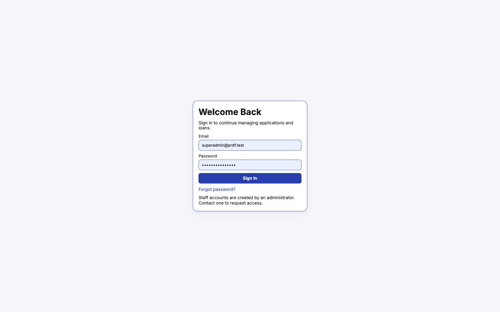
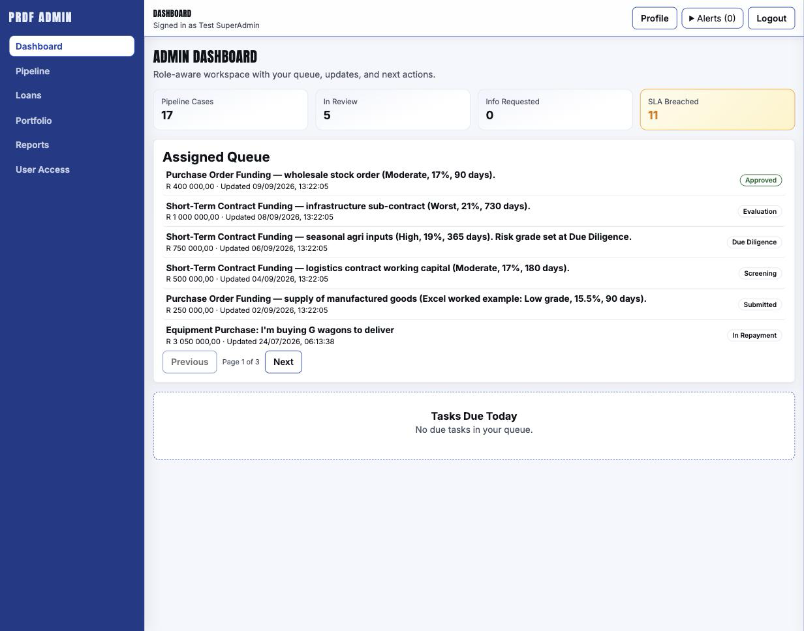

**Expected:** valid credentials reach the Dashboard; wrong password shows an inline error.

---

### WT-2 — Dashboard tour

_Log in as `admin@prdf.test`._

1. Review the summary tiles (pipeline counts, portfolio figures).
2. Use the left navigation to move between areas.


**Expected:** tiles render with the seeded applications reflected in the pipeline counts.

---

### WT-3 — Pipeline: find and open a case

_Log in as `admin@prdf.test`._

1. Go to **Pipeline**.
2. Confirm the five seeded applications from §6 are listed with their statuses.
3. Click **Thuli Manufacturing** (R250,000, Submitted) to open the **Case** page.

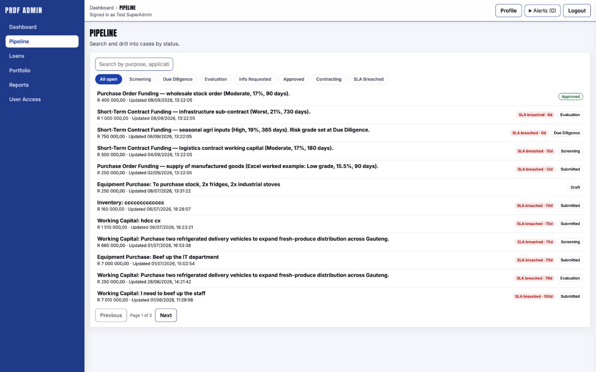

**Expected:** all five appear; clicking opens the case workspace with a lifecycle rail at the top.

---

### WT-4 — Case overview & advancing status

_Log in as `intakeclerk@prdf.test` (owns the Submitted stage)._

1. Open **Thuli Manufacturing** (Submitted).
2. On the **Overview** tab, review the applicant and requested amount.
3. In the left action rail, choose the next status **Screening** and confirm.
4. Watch the lifecycle rail advance.

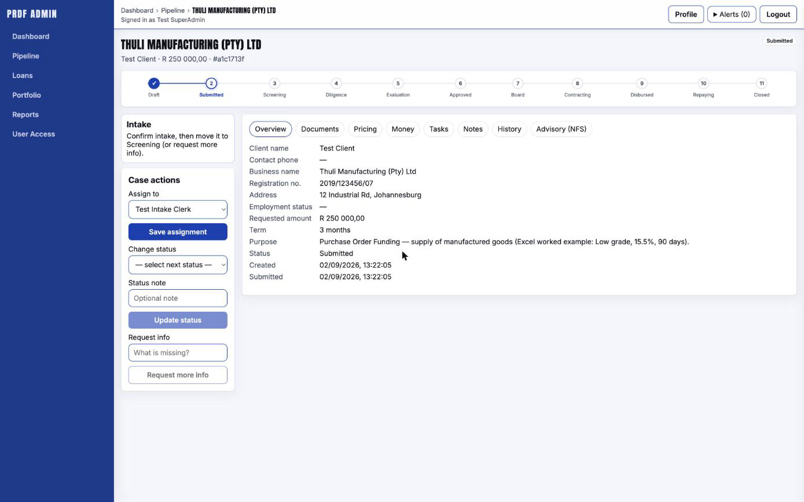

**Expected:** status moves Submitted → Screening; an entry appears in **History**. Trying an illegal
jump (e.g. straight to Approved) is rejected.

---

### WT-5 — Documents tab

_Log in as any workflow role or Admin._

1. On a case, open the **Documents** tab.
2. Review uploaded documents; open a document to preview it.
3. (If permitted) mark a document Verified / Rejected.

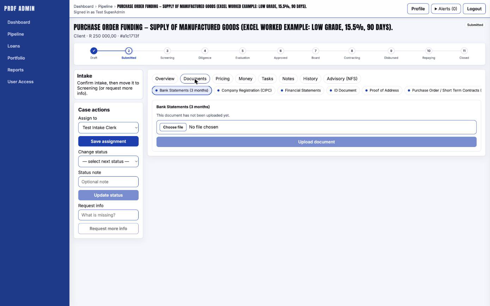

**Expected:** documents list and preview render; verification controls behave per role.

---

### WT-6 — Pricing tab (credit-model calculator) ⭐

_Log in as `riskanalyst@prdf.test`._ This is the credit model from the Excel.

1. Open **Kagiso Agri Supplies** (R750,000, DueDiligence).
2. Open the **Pricing** tab.
3. Enter: **Principal** `250000`, **Days financed** `30`, **Risk grade** `Low`, **Days late** `30`.
4. Click **Calculate quote**.
5. Verify the breakdown matches the Excel worked example **to the cent**:

| Line | Expected |
|------|---------:|
| Annual rate | 15.50% |
| Interest | R3,184.94 |
| Initiation fee | R1,000.00 |
| Management fee | R7,500.00 |
| Penalty (30 days late) | R5,063.70 |
| Total due to funder | R253,184.94 |
| Total client revenue | R16,748.64 |

6. Check the **late-payment scenarios** table: 30d R5,063.70 · 60d R10,127.40 · 90d R15,191.10 · 120d R20,254.80.
7. Re-run for the other scenarios in §6 (e.g. R750,000 / High / 365 days) and sanity-check the rate/fees.

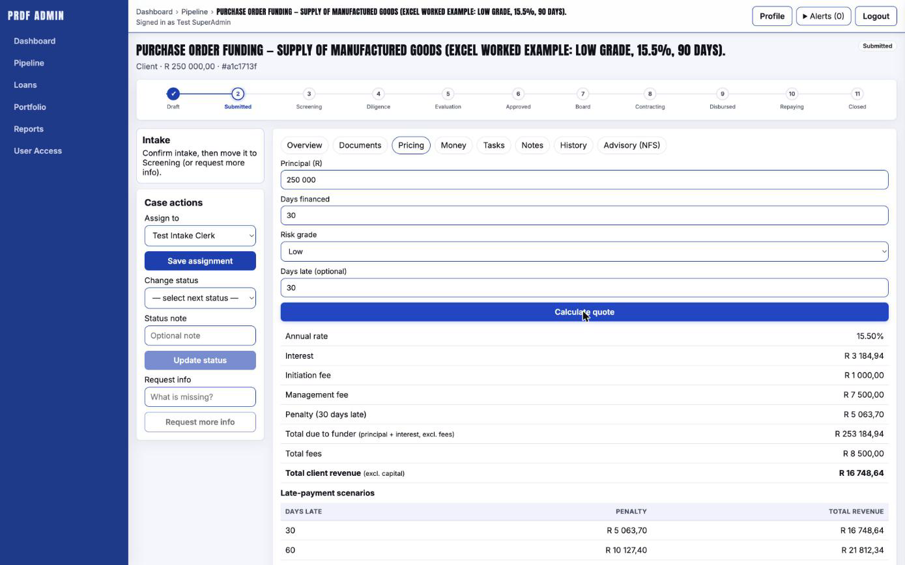

**Expected:** numbers match the table exactly. (Rounding is round-up to the cent — see §12.)

---

### WT-7 — Money tab (disbursement & repayments)

_Log in as `financeofficer@prdf.test`._

1. Open an application that has reached a fundable stage.
2. Open the **Money** tab.
3. Review disbursement/repayment controls. (Only exercise disburse/repayment on test data.)

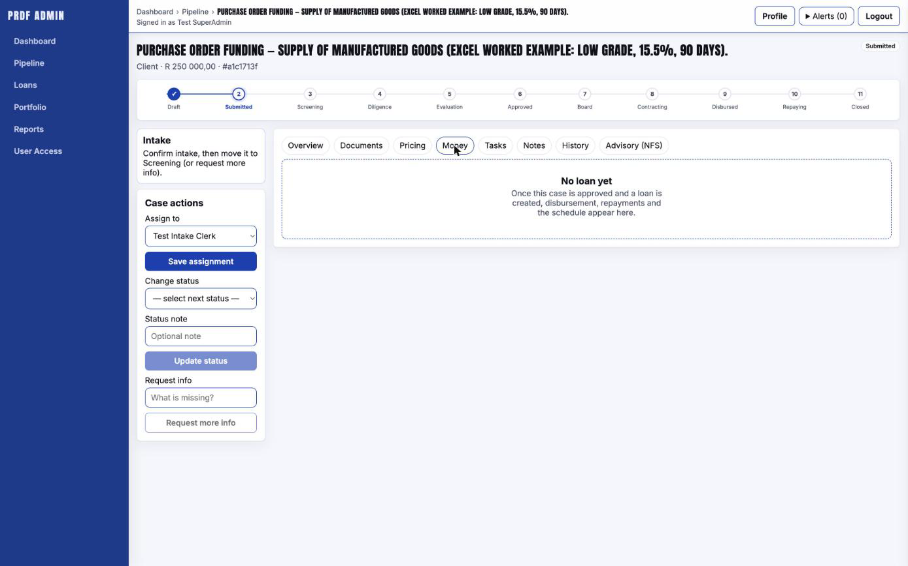

**Expected:** controls appear per role; recorded repayments update the schedule.

---

### WT-8 — Tasks & Notes

_Log in as any workflow role._

1. On a case, open **Tasks** — create a task, assign it, mark complete.
2. Open **Notes** — add an internal note; confirm it timestamps and persists.

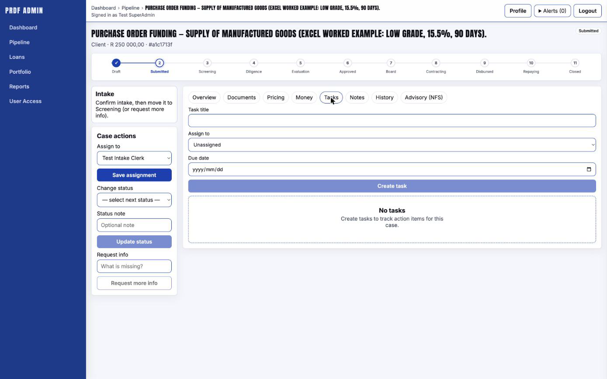

**Expected:** tasks and notes save and reappear on reload.

---

### WT-9 — Reports (management)

_Log in as `programmanager@prdf.test` (or Admin)._

1. Go to **Reports**.
2. Open a few reports (pipeline, demographics, arrears/collections).
3. Export a CSV where offered.

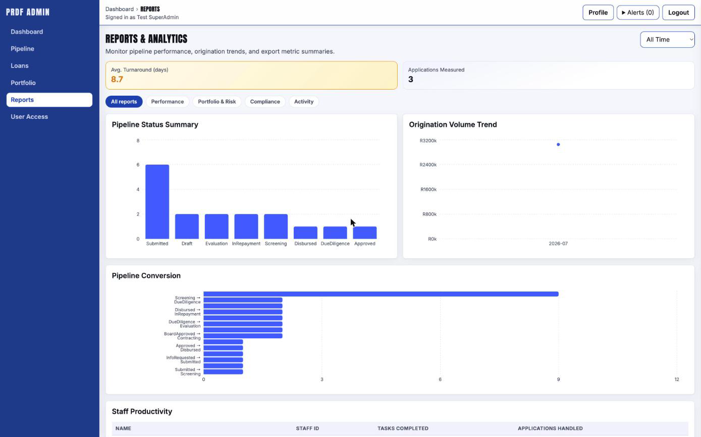

**Expected:** reports render using the seeded data; CSV downloads.
_Note:_ a **workflow** role (e.g. RiskAnalyst) has **no** Reports link — verify that access difference.

---

### WT-10 — User Access (Admin only) & the Client-role rule

_Log in as `admin@prdf.test`._

1. Go to **User Access**.
2. Find a test user and open the **Assign Role** dropdown.
3. **Verify `Client` is NOT in the dropdown** — it cannot be granted from the admin.
4. Assign a workflow role (e.g. `RiskAnalyst`) to a user → succeeds.
5. Remove a role via the chip's **×** → succeeds (removal, including Client, is allowed).

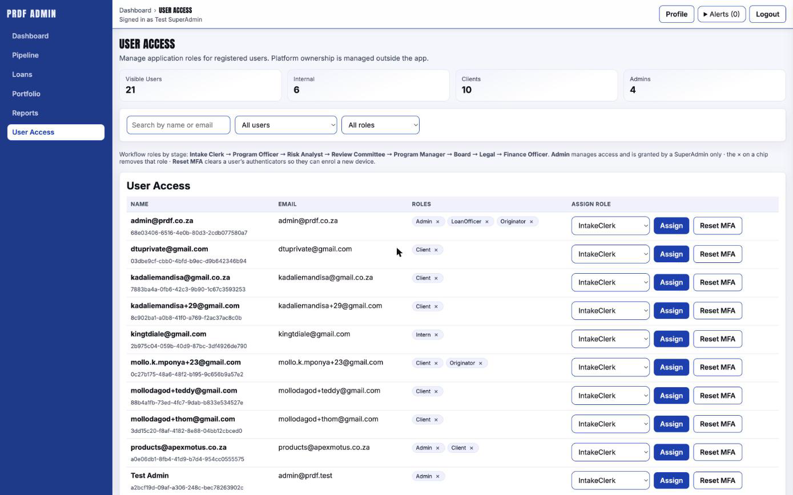

**Expected:** Client is absent from Assign Role; other roles assign/remove normally; the **Clients**
KPI/filter still appear.

---

### WT-11 — Role-based access differences

1. Log in as `riskanalyst@prdf.test`: confirm **no** Portfolio / Reports / Loans / User Access.
2. Log in as `admin@prdf.test`: confirm **all** areas appear.
3. Log in as `client@prdf.test`: confirm the admin portal shows **Access restricted**.

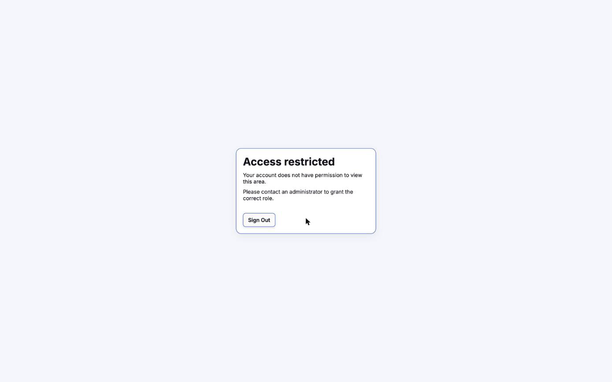

**Expected:** navigation and gating match the matrix in §4.

---

### WT-12 — Client portal (optional)

_Log in at the client URL (§1) as `clientadmin@prdf.test` or `client@prdf.test`._

1. Confirm the client can see their applications and status.
2. (Dual user) confirm `clientadmin@prdf.test` can also enter the **admin** portal.

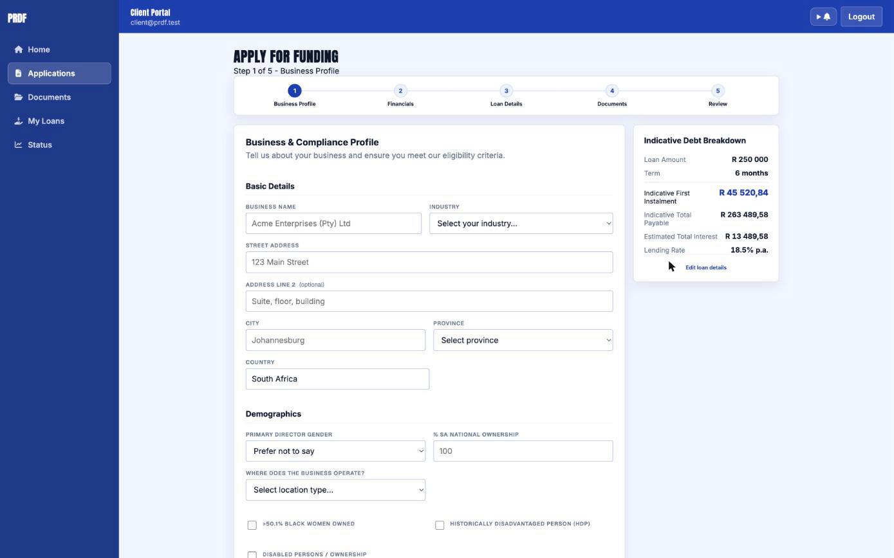

---

## 8. QA checklist (pass/fail)

| ID | Check | Role | Pass/Fail |
|----|-------|------|:---------:|
| C1 | Valid login reaches Dashboard | any staff | |
| C2 | Wrong password shows error | any | |
| C3 | Client-only user blocked from admin | client | |
| C4 | Dual Client+Admin enters admin | clientadmin | |
| C5 | All 5 seeded applications visible in Pipeline | admin | |
| C6 | Open case → lifecycle rail + tabs render | admin | |
| C7 | Legal status advance succeeds (Submitted→Screening) | intakeclerk | |
| C8 | Illegal status jump rejected | intakeclerk | |
| C9 | Pricing worked example matches to the cent | riskanalyst | |
| C10 | Late-payment 30/60/90/120 penalties correct | riskanalyst | |
| C11 | Client absent from Assign Role dropdown | admin | |
| C12 | Workflow role can assign; role removal works | admin | |
| C13 | Reports visible to management, hidden from workflow | pm / riskanalyst | |
| C14 | Documents preview/verify works | workflow | |
| C15 | Tasks & Notes persist | workflow | |

---

## 9. Reporting a bug

Include: which **test user/role**, the **URL/screen**, **steps to reproduce**, **expected vs actual**,
a **screenshot**, and the time. Note anything from §12 that may explain it before filing.

---

## 10. Resetting / re-seeding test data

Test data is idempotent. If it drifts, an operator can re-run the seed scripts against the test DB:

- `infra/supabase/seed/seed-test-users.sql` — the 12 users above.
- `infra/supabase/seed/seed-test-applications.sql` — the 5 applications.

Both are safe to re-run (they converge to the same state). **Test environment only.**

---

## 11. Environment notes

- Admin portal: `https://prdf-admin.vercel.app` → API `https://prdf-api.vercel.app` → Supabase (`prdf`).
- Client portal: `https://prdf-lms.vercel.app`.
- If a page fails to load data, refresh and confirm you are logged in.
- Session expires after a period of inactivity — just log in again.

---

## 12. Known behaviours / notes

- **Rounding:** monetary results are **rounded up to the cent**. This can differ from the client's
  spreadsheet (standard rounding) by one cent on some totals (e.g. worked-example total
  R16,748.64 here vs R16,748.63 in the sheet). This is a known, deliberate configuration.
- **Risk grade** is a Pricing-tab input for now; it is not yet persisted on the application record.
- **Client role** cannot be assigned from the admin by design (§ WT-10).
- **Public estimate calculator uses the legacy model.** The client portal's landing-page
  "indicative estimate" (and the apply wizard's "Indicative Debt Breakdown") uses the old
  monthly-amortising model at **18.5% p.a.**, not the new credit model (Prime + risk-grade margin,
  15.5–21%) that staff see on the admin **Pricing tab**. Indicative figures shown to applicants will
  therefore differ from the staff quote — expected for now, pending alignment of the public
  calculator with the new pricing engine.

---

## 13. Screenshot capture checklist

Capture each at 1280×800 (or default window), logged in as the role noted, and save to
`docs/screenshots/` with the filename shown.

| Figure | File | Screen | Role |
|-------:|------|--------|------|
| 1 | `01-login.png` | Login page | — |
| 2 | `02-dashboard.png` | Dashboard after login | superadmin |
| 3 | `03-admin-dashboard.png` | Dashboard tiles | admin |
| 4 | `04-pipeline.png` | Pipeline list (5 apps) | admin |
| 5 | `05-case-overview.png` | Case Overview + status action | intakeclerk |
| 6 | `06-documents.png` | Documents tab | admin |
| 7 | `07-pricing.png` | Pricing tab worked example | riskanalyst |
| 8 | `08-money.png` | Money tab | financeofficer |
| 9 | `09-tasks-notes.png` | Tasks & Notes | admin |
| 10 | `10-reports.png` | Reports | programmanager |
| 11 | `11-user-access.png` | User Access (no Client in dropdown) | admin |
| 12 | `12-access-restricted.png` | Access restricted | client |
| 13 | `13-client-portal.png` | Client portal | client |
